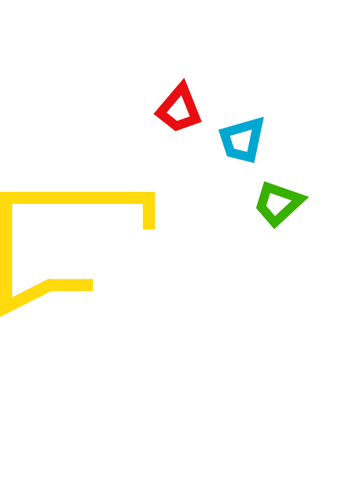

<!-- PROJECT LOGO -->
<div align="center">
  
  
  <br>
  <h2 align="center">Kamus Bahasa Dayak</h2>
  <h3 align="center">Naraicoder</h3>
  <p align="center">
    Mari belajar dan membangun bersama kami, bergabung dengan komunitas 
    <a href="https://t.me/naraicoder"><strong>klik disini »</strong></a>
    <br>
    <a href="https://t.me/naraicoder">Telegram</a>
     . 
    <a href="https://www.instagram.com/p/CPlC5CaAxxL/?utm_medium=copy_link">Instagram</a>
  </p>
</div>

<!-- INSTALASI -->
## Installation Project
Berikut ini cara instalasi project dengan server local, silahkan mengikuti cara dibawah ini.

### Persiapan
Dokumentasi resmi <a href="https://nextjs.org/learn/basics/create-nextjs-app/setup"> klik disini </a>
* Pastikan komputer anda telah terinstall node.js versi 10.13 atau diatasnya.
* Buka cmd dan atur lokasi project yang diinginkan.
* Clone atau download file atau repository, 
  <br>
  Jika menggunakan HTTPS
  ```sh
  git clone https://github.com/Narai-Coder-Projects/naraicoder-kamus-bahasa-dayak-web.git
  ```
   Atau menggunakan SSH
  ```sh
  git clone git@github.com:Narai-Coder-Projects/naraicoder-kamus-bahasa-dayak-web.git
  ```
* Masuk ke folder 
  ```sh
  cd naraicoder-kamus-bahasa-dayak-web
  ```
* Instalasi dependencies, 
  <br>
  Jika menggunakan yarn
  ```sh
  yarn install
  ```
  atau menggunakan npm
   ```sh
  npm install
  ```
<!-- PENGGUNAAN -->
## Cara menjalankan project
Dokumentasi resmi <a href="https://nextjs.org/docs/getting-started"> klik disini </a>
* Menjalankan Server local, 
  <br>
  Menggunakan yarn
  ```sh
   yarn dev
   ```
   Menggunakan npm
   ```sh
   npm run dev
   ```
 * Buka browser untuk membuka project
   ```sh
   http://localhost:3000
   ```
